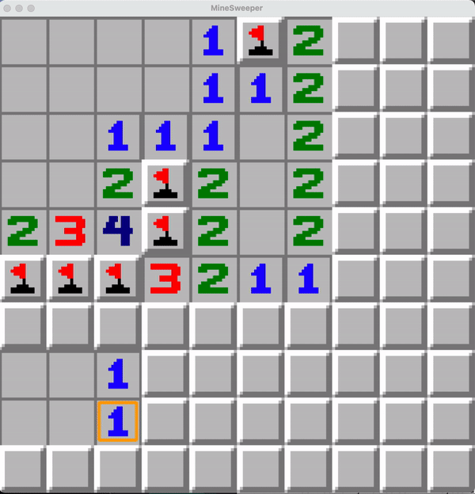

# MineSweeper



## Usage

### Arguments

|Flag| Type | Description |
|----|------|-------------|
|`--dim`|`int`|Dimension of the minesweeper board|
|`--agent`|`none\|basic\|advanced`|Which agent to use (if any)|
|`--bomb_count`|`int`|Number of bombs to place randomly across the board|

### Example
Refer to _DEVELOPMENT_ for how to setup virtualenv
```bash
$ source minesweepervenv/bin/activate
$ python3 main.py --agent basic --dim 25 --bomb_count 20
```

## Commands

### Game Commands
|Key|       Function             |
|---|----------------------------|
|`RETURN`|Open tile the agent is currently at|
|`f`|Place flag on tile the agent is currently at|


### Debugging Commands

|Key|       Function             |
|---|----------------------------|
|`s`|Hold down to highlight bombs|
|`r`|Re-initialize board tiles   |

---

## Development
### 1. Clone Repository (Do this once)
```bash
$ git clone https://github.com/reaganmcf/MineSweeper
$ cd MineSweeper
```

### 2. Setup Virtual Environment (Do this once)
- If you don't have `venv` installed, run the following
  ```bash
  python3 -m pip install --user virtualenv
  ```

```bash
$ python3 -m venv minesweepervenv
```

### 3. Activate Virtual Environemnt (Do this everytime)
```bash
source minesweepervenv/bin/activate
```

### 4. Install packages (Do this when you're missing new libraries added to `requirements.txt`)

```bash
(minesweepervenv) $ pip install -r requirements.txt
```

### 5. Update `requirements.txt` (Do this whenever you add a new library to the project so the change is reflected on github)
```bash
(minesweepervenv) $ pip freeze > requirements.txt
```
